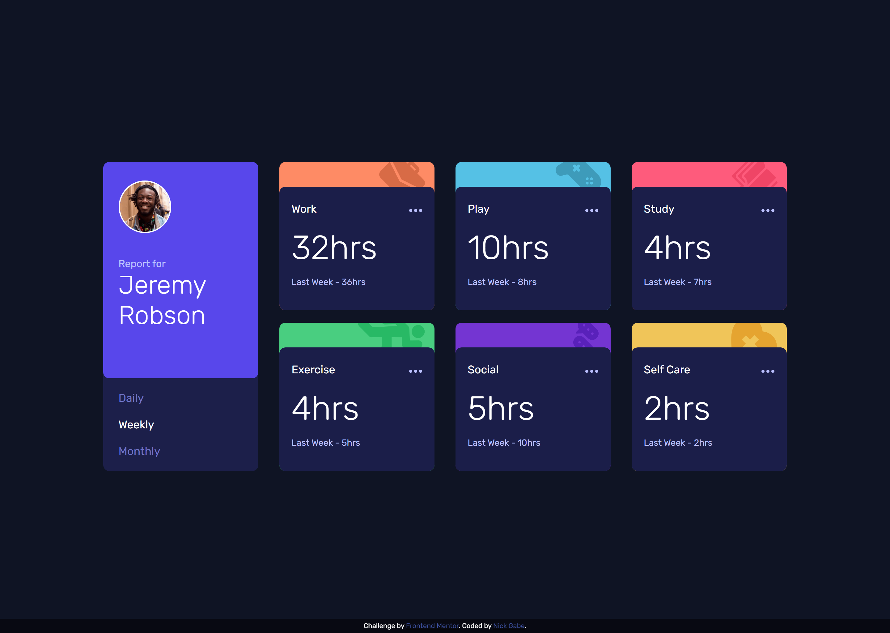

# Frontend Mentor - Time tracking dashboard solution

This is a solution to the [Time tracking dashboard challenge on Frontend Mentor](https://www.frontendmentor.io/challenges/time-tracking-dashboard-UIQ7167Jw). Frontend Mentor challenges help you improve your coding skills by building realistic projects. 

## Table of contents

- [Overview](#overview)
  - [The challenge](#the-challenge)
  - [Screenshot](#screenshot)
  - [Links](#links)
- [My process](#my-process)
  - [Built with](#built-with)
  - [What I learned](#what-i-learned)
  - [Continued development](#continued-development)
- [Author](#author)

## Overview

### The challenge

Users should be able to:

- View the optimal layout for the site depending on their device's screen size
- See hover states for all interactive elements on the page
- Switch between viewing Daily, Weekly, and Monthly stats

### Screenshot

### Links

- Solution URL: [Click here](https://www.frontendmentor.io/challenges/time-tracking-dashboard-UIQ7167Jw/hub/responsive-timetracker-using-grid-js-and-sass-NgGHHSU0_)
- Live Site URL: [Click here](https://nick-gabe.github.io/frontend-timetracking-dashboard/)

## My process

This was a tough challenge, im not a huge fan of grid haha. But anyways, I started by doing the html, looking forward to what would be divided or not so I don't have to change it later. After that I began to question, "if there is a json file with all the data, why don't I let the Js write the html, instead of me manually doing every card?" and that's what I did!

I wrote a default html for the cards and made it so Js could change some things and make every card unique and with their own contents. With that finished, it was time to do some Css, but I tried Sass this time, my first try with it but I really enjoyed.

### Built with

- Semantic HTML5 markup
- JavaScript Dom manipulation
- Variable content generation
- CSS custom properties
- Flexbox
- CSS Grid
- Mobile-first workflow
- [Sass](https://sass-lang.com)
- Scalable Vector Graphics (Svg)

### What I learned

I learned more about svg, creating html through JavaScript and receiving data through json.
I am really proud of my organization this time, I have read about BEM and now my class names are way better and understandable.

### Continued development

I feel my Css isn't optimal yet, so the training continues!

## Author

- Frontend Mentor - [@Nick-Gabe](https://www.frontendmentor.io/profile/Nick-Gabe)
- CodePen - [@Nick-Gabe](https://codepen.io/nick-gabe)
- GitHub - [@Nick-Gabe](https://github.com/Nick-Gabe/)
- Twitter - [@MyNickIsNick_](https://www.twitter.com/MyNickIsNick_)